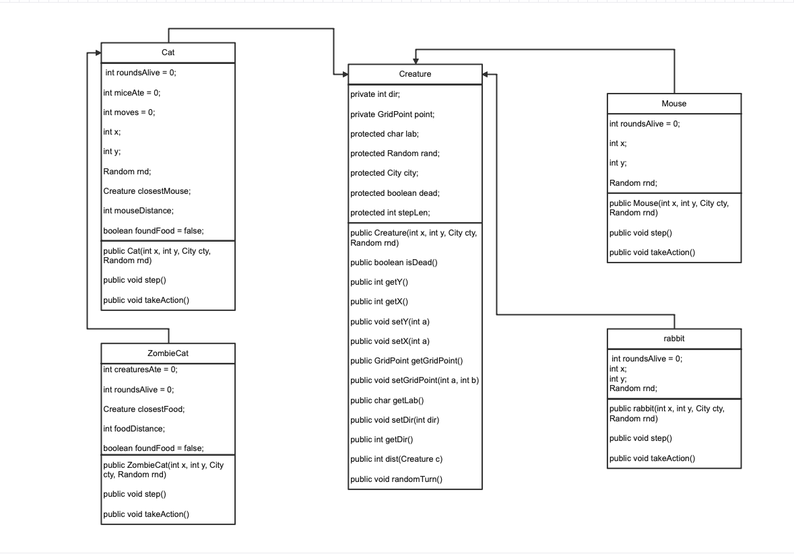

# Project 2

## Describe your work

## Part 1: UML Diagram

Note that you must do two tasks here:

1. Add to your repo a document `UML.png` that is a image of your UML diagram
2. Update the document `OOP-design.md` that describes your OOP design, referencing your document.
3. You will receive feedback on your design in a github issue

For your final submission, please update `UML.png` with the final UML diagram and `OOP-design.md` with your final description. Below describe the major changes you made.

# OOP Design Document

## Overview

[provide a general overview of your OOP design. Once you do, remove this text!]

[For each of the classes in your OOP design, including ones provided
for you, offer a brief description of their functionality and how they
interact. Be sure to highlight good OOP like encapsulation,
inheritance, and polymorphism. Once you do, remove this text! Also be
sure the headers below match the class names, and not Class 1 and
Class 2 and etc.]

Part 1: UML Diagram

Note that you must do two tasks here:

1. Add to your repo a document UML.png that is a image of your UML diagram
2. Update the document OOP-design.md that describes your OOP design, referencing your document.
3. You will receive feedback on your design in a github issue

For your final submission, please update UML.png with the final UML diagram and OOP-design.md with your final description. Below describe the major changes you made.

I got rid of the chase function in cat and ZombieCat, i noticed I coud just change the direction in take action without doing anything extra. In the iterator in takeAction for cat and ZombieCat I made it so it checks for both mouse and rabbit. I also didnt end up using the X and Y in the constructor for each class, since I just added a getX() and getY() in the creature class. I also got rid of the turnZombie() function in Cat since it didnt work, instead I implemented it in takeAction().

## Part 2: Implementation

What level simulation did you achieve

Level : [4] <-- choose one!

## Implementation before Level 4

Level 0: Mice (up to 35 points) #

Full implement mice actions such that:

After 20 rounds of simulation time, a mouse produces a new baby mouse at the same location
A mouse dies after 30 rounds simulation time
A mouse randomly turns, changes directions 20% of the time
A mouse is displayed as a blue dot.
Level 1: Mice and Cats (up to 45 points) #

Add a cat to the simulation

A cat eats a mouse if they end up on the same location. That is, the mouse should die and be removed from the simulation.
If a cat doesn’t eat a mouse within 50 moves, the cat dies.
Cats jump two spaces at a time. They do not traverse the grid point they jump over. That is, if they are on space (1,2) they would move to (1,4).
Cats randomly turn, change direction, 5% of the time.
Cats are displayed as a yellow dot.
Additionally, in your simulator, have it such that

Every 100 rounds, a mouse is added to a random location in the city
Every 25 round, a cat is added to a random location in the city
Level 2: Cats chase mice (up to 55 points) #

In this level, cat’s get a bit smarter …

A cat searches up to 20 grid points (as measured by the GridPoint.distance() method) for a mouse to chase.
If the cat finds a mouse, it moves towards the mouse and is displayed using the color cyan. (This is to make it easier for you to debug, and for us to grade).
If the cat cannot find a mouse, it moves normaly and is displayed in yellow.
Level 3: Zombie-Cats chase Cats and Mice (up to 65 points) #

Let’s add zombie cats to the mix!

First a modification to Cats:

If Cat does not eat within 50 rounds, they instead turn into a Zombie Cat.
Now let’s define Zombie Cats:

Zombie cats chase both mice and other non-zombie cats
Zombie cats can search up to 40 gird squares away (as measured by GridPoint.distance()
Zombie cats eating a mouse is the same as a normal cat. The mouse dies and is removed from the simulation.
When a zombie cat eats a cat, that cat becomes a zombie cat placed at the same location in the grid square
A zombie cat when not chasing another creature is displayed as red dot.
A zombie cat chasing another creature is displayed as a black dot
A zombie cat jumps 3 spaces at time. It does not move through the intervening space. That is, if it is at (5,10) it moves directly to (5,13).
A zombie cat that doesn’t eat anything within 100 rounds dies.
Level 4: Create a new creature type (up to 75 points) #

The final level of the simulation is for you to add a new creature of any type or behavior you want to the simulation. It should fit into the general model of creatures we already have and derive from Creature.

You should include this extra creature in the planning stage (Part A of the project), and fully describe its functionality in the README.md file.

Particularly creative creatures may be subject to bonus points (up to 5), at the description of the grader.

If you completed Level 4, describe the additional creature you added to the simulation.

- rabbit extends from creature
- at the beggining, only 4 rabbits are put in the grid.
- it has most of the same characteristics as mouse, but there a few differences.
    - the step length for rabbit is 4, since they can jump far
    - they are displayed pink
    - and in takeAction() there is an iterator to go through the list of creatures, and if the current rabbit and another rabbit meet at the same spot they make a baby rabbit at the same X and Y.
    - rabbits never die. 
    - they randomly turn 40% of the time. 
- rabbits can be eaten and chased by cats and ZombieCats the same as mouse.

